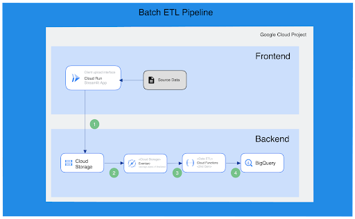

# Terraform Data Pipeline Project for Tobipets

This project is a continuation of my Terraform learning journey which began with my first Terraform project [Creating a VPC with Terraform](https://github.com/austinbrees/creating-vpc-with-terraform). I learned a lot from that initial experience. In particular, I discovered that using the Terraform SDK in Visual Studio Code is much easier and more efficient than working directly from the Cloud Shell editor.

## Project Overview

This repository contains the codebase for a data pipeline project created for Tobipets. This project is a recreation and enhancement of an original project created during our Cloud Native Applications class. The goal is to transform Tobipets' data management from Excel-based to a structured data warehouse, providing the opportunity to perform robust analytics on their data.

The pipeline is designed around a Streamlit application that uploads files to a Google Cloud Storage bucket. The data in the bucket is then processed and transformed by Google Cloud Functions (Gen 2). Once the data is transformed, it is uploaded to BigQuery, a fully-managed data warehouse on Google Cloud, for analytics purposes.

## The Problem
Tobipets, a company currently managing its data using Excel, needs an application to transform and upload their current data into a structured data warehouse for better data analytics.

## The Solution
This project implements a data pipeline using various Google Cloud services to solve this problem. The data pipeline includes:

- Streamlit application for uploading data to a Cloud Storage bucket
- Google Cloud Functions for transforming the data
- Google BigQuery for storing and analyzing the transformed data

## Infrastructure as Code (IaC)

For this project, we use Terraform - an open-source infrastructure as code software tool. Terraform enables us to define and provide data center infrastructure using a declarative configuration language. This allows us to automate the creation and modification of our cloud resources, ensuring that our infrastructure is kept in a known state and allowing us to manage it in a predictable way.

## Project Structure

This version of the project focuses on creating the compute parts of the data pipeline - Streamlit application, Google Cloud Functions, and the integration between them. In later versions, we will explore creating the storage parts of the pipeline with Google Cloud Storage and BigQuery.

## Getting Started
To get started with this project, you will need:

- A Google Cloud account
- Terraform installed
- Basic knowledge of Terraform

## Future Enhancements

Future versions of this project will focus on creating the storage parts of the data pipeline. We'll be looking into automating the creation and configuration of Google Cloud Storage buckets for raw data storage and Google BigQuery for the data warehouse.